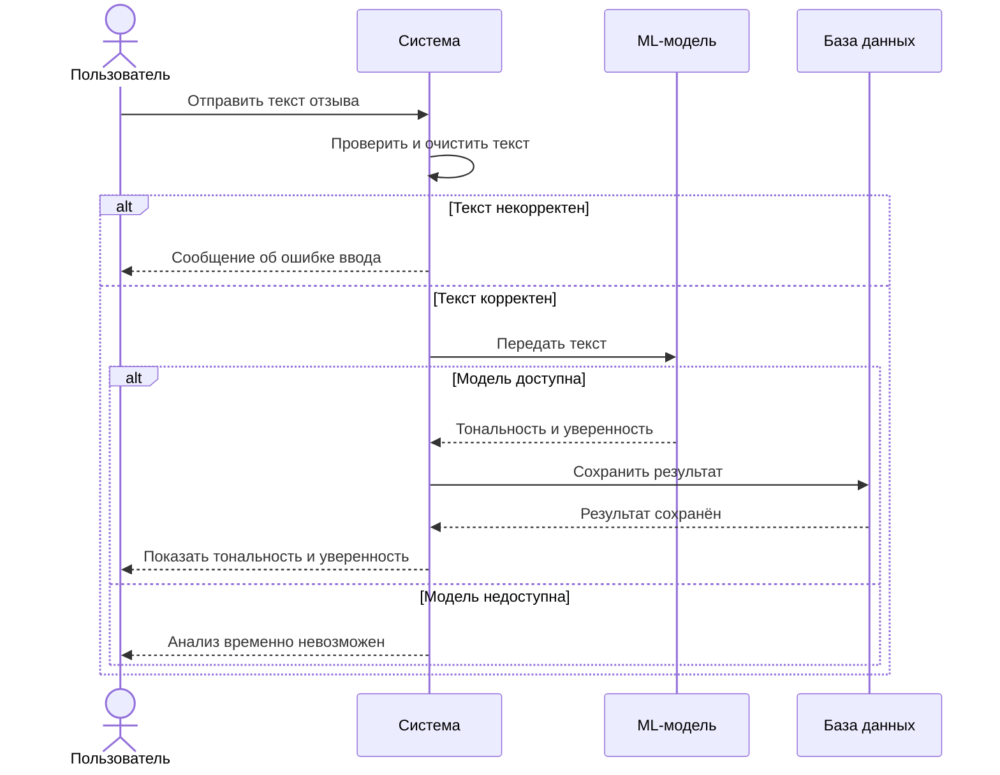
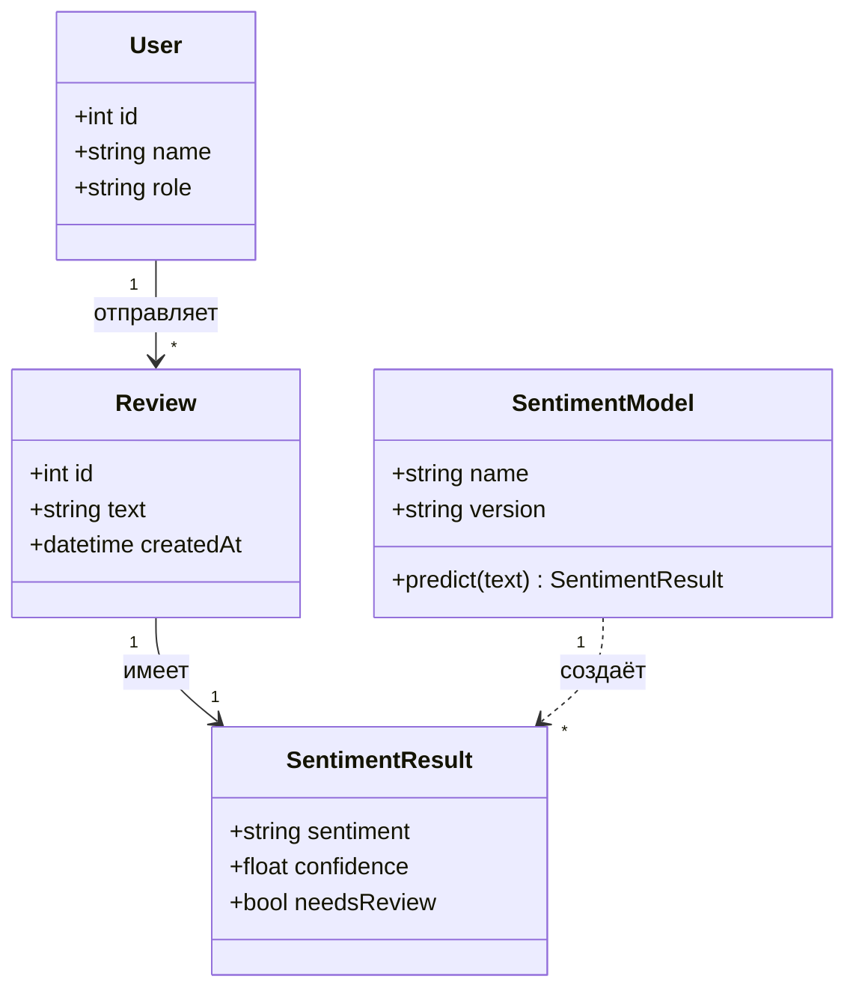

# Диаграммы

## Диаграмма последовательности

Сценарий UC-01 «Определение тональности отзыва».

```mermaid
sequenceDiagram
    actor User as Пользователь
    participant System as Система
    participant Model as ML-модель
    participant DB as База данных

    User->>System: Отправить текст отзыва
    System->>System: Проверить и очистить текст
    alt Текст некорректен
        System-->>User: Сообщение об ошибке ввода
    else Текст корректен
        System->>Model: Передать текст
        alt Модель доступна
            Model-->>System: Тональность и уверенность
            System->>DB: Сохранить результат
            DB-->>System: Результат сохранён
            System-->>User: Показать тональность и уверенность
        else Модель недоступна
            System-->>User: Анализ временно невозможен
        end
    end
```

## Диаграмма классов

```mermaid
classDiagram
    class User {
        +int id
        +string name
        +string role
    }
    class Review {
        +int id
        +string text
        +datetime createdAt
    }
    class SentimentResult {
        +string sentiment
        +float confidence
        +bool needsReview
    }
    class SentimentModel {
        +string name
        +string version
        +predict(text) SentimentResult
    }

    User "1" --> "*" Review : отправляет
    Review "1" --> "1" SentimentResult : имеет
    SentimentModel "1" ..> "*" SentimentResult : создаёт
```
